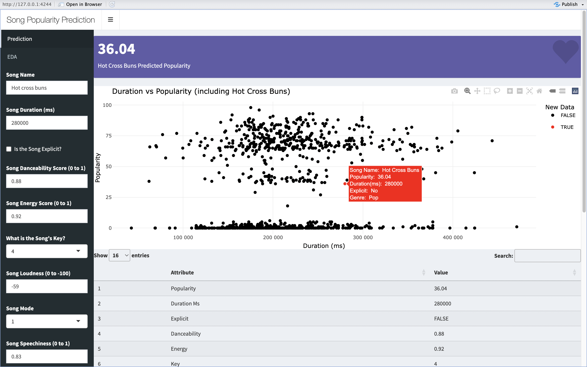

## Song Popularity Prediction Project (In Progress)
**If you are visiting from my CV, please go to the `class-submissions` folder to see my code and writing submissions**

*Apologies for the incomplete README, I am currently in the process of expanding upon this project!*

This is an expansion of the final project for STAT 1361. In this project we are given a data set containing a list of songs across three genres (pop, rock, and jazz), their characteristics, and their popularities. I will explore the data and then create several models to predict a song's popularity based on the given information. 

## Table of Contents
1. [**Introduction**](#introduction)
2. [**EDA**](#eda)
3. [**Modelling**](#modelling)
4. [**Shiny Dashboard**](#shiny-dashboard)

## Introduction (The Hypothetical Scenario)
SonicWave Productions is a growing company seeking to gain headway in the music industry. The music industry is valued at 14.34 billion as of 2024 and is projected to consistently grow in the following years (Statista, 2024). To gain a competitive advantage and grow SonicWave’s market share, it is imperative to understand what factors are most important in creating a popular song.

As a Data Science Consultant , I was hired to predict the popularity of songs from rock, jazz, and pop genres. I was provided a data set with 1200 observations across 19 variables that encompassed various song metrics. Such a model would empower their team of music professionals to swiftly identify songs that are either undervalued or overvalued in the market, facilitating strategic decisions in song selection, promotion, and distribution. In this README, I will highlight the analyses I conducted to understand the relationships within the data, how I cleaned the data, the models I developed and how they performed, and my final takeaways regarding how the models should or should not be utilized.

## EDA
To view my exploratory data analysis, please open the `exploratory-analysis.Rmd` file.

### EDA Highlights

I first looked at how popularity differed when compared with the categorical variables in the data set, specifically track genre and time signature. As is shown in the boxplot figure to the right, pop (green) has most of the popular songs while jazz (red) has mostly lower and middle rated songs and rock (blue) has almost entirely lower rated songs, with its higher rated songs falling outside of 1.5*IQR of its bounds. I then looked at how popularity differed by time signature. It appears that there is no real difference between time signatures of 3, 4, and 5; though time signatures of 1 seemed to have a larger density of lower popularity longs. Another interesting finding was that songs that were not explicit tended to have a higher density of lower ranked songs and very few extremely high ranked songs while explicit songs tended to have either lower ranked or extremely high ranked songs. Overall, very few of the variables appeared to follow a normal distribution. There also appeared to be some level of collinearity between energy and loudness. However, since there are only a small number of variables to work with, I elected to keep both in the model and address the issue via model selection techniques.

The data set did not have any missing values. There were also no outliers in the popularity values as they ranged from 0-100. However, upon examining the time signature variable, I found that there was only one value for time signatures of 1 and no values for time signatures of 2. Because these values were so small, I elected to remove them entirely from the dataset so that the other variables could be properly considered.

## Modelling

Multiple models were considered for predicting the popularity of songs across the rock, jazz, and pop genres. Each model tried, a small description of the model, and their final test MSE is reported below:

| **Model** | **Description** | **MSE** | **Root MSE** |
|-----------|-----------------|---------|--------------|
| Multiple Linear Regression | Simple MLR with all 15 variables | 877.32 | 29.62 |
| Best Subset Selection | BSS algorithm, chose output with only genre variable | 877.32 | 29.62 |
| LASSO Regression | Chose 11 variables including genre | 857.25 | 29.28 |
| After LASSO OLS | OLS ran with variables chosen by LASSO | 1058.71 | 32.54 |
| Ridge Regression | Largest effect was genre | 877.89 | 29.63 |
| Bagged Random Forest | Full size trees: genre was most important | 707.13 | 26.59 |
| *Random Forest* | *Mtry value selected as p/3 ~ 5, genre was most important* | *694.76* | *26.36* |
| BART Model | Bayesian Additive Regression Tree model | 847.19 | 29.11 |
| Boosted Tree | Normal boosted tree | 919.81 | 30.33 |

Overall, the random forest with an mtry value of 5 and ntree value of 501 (odd number to resolve any ties) performed the best by the metric of mean squared error. The bagged random forest performed similarly well but all the other models were significantly worse. I chose to use MSE as a measure as it is a standard measure of predictive error for regression tasks. The RMSE (Root Mean Squared Error) is also listed as it is in the same unit as the `popularity` vairable, making it easier to interpret.

## Shiny Dashboard

Finally, I decided to create a web dashboard to summarize my findings and deploy my random forest model using R Shiny and the `shinydashboard` package. After filling out the requried characteristics of a song using the left-hand panel and hitting the 'run model' button, the random forest model that was found to perform the best will generate a prediction for that song's popularity. Below the output, a graph will display where the entered song falls in comparison to all other songs in the model's data. Finally, at the bottom of the dashboard, a table is presented that lists the predicted popularity and all other entered characteristics for the song of interest.

*Things to add:*
- *Separate page that lists basic exploratory charts before running model*
- *Add chart for random forest variable importance*

